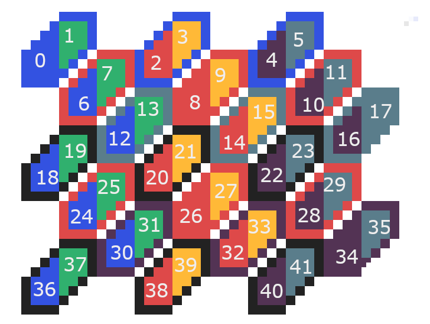

Here is a hexagon grid. It is 6 across (in half-hexes) and 7 tall (in whole hexes).

Each half hexagon only touches four other half-hexagons, one in each cardinal direction. So we want to define movement in terms of the cardinal directions. The numbers indicate the index they would have in the grid array if the grid was exactly this size. It (currently?) isn't, so we want to express the movement formula in terms of the grid width and height.

Notice the the rows are offset vertically and horizontally in a pattern that repeats every three rows. In terms of movement formulas, there appears to be three types of hexagons, implying six kinds of half hexagons. THere are four cardinal directions, so that implies a table of six times four = 24 entries is required, assuming no patterns emerge.

Note formula contains a formula for a number that should be *added* to the given hex-half's number.

| Row Type | Left/Right Side | Movement Direction | Formula |
|----------|-----------------|--------------------|---------|
| 0        | Left Side       | Up                 |-(W + 1) |
| 0        | Left Side       | Down               | 2W - 1  |
| 0        | Left Side       | Left               |  W - 1  |
| 0        | Left Side       | Right              |     1   |
| 0        | Right Side      | Up                 |-(2W + 1)|
| 0        | Right Side      | Down               |  W - 1  |
| 0        | Right Side      | Left               |    -1   |
| 0        | Right Side      | Right              |-(W + 1) |
| 1        | Left Side       | Up                 |-(W - 1) |
| 1        | Left Side       | Down               |  2W + 1 |
| 1        | Left Side       | Left               |  W - 1  |
| 1        | Left Side       | Right              |     1   |
| 1        | Right Side      | Up                 |-(2W + 1)|
| 1        | Right Side      | Down               |  W - 1  |
| 1        | Right Side      | Left               |    -1   |
| 1        | Right Side      | Right              |-(W - 1) |
| 2        | Left Side       | Up                 |-(W - 1) |
| 2        | Left Side       | Down               | 2W + 1  |
| 2        | Left Side       | Left               |  W + 1  |
| 2        | Left Side       | Right              |     1   |
| 2        | Right Side      | Up                 |-(2W - 1)|
| 2        | Right Side      | Down               |   W + 1 |
| 2        | Right Side      | Left               |    -1   |
| 2        | Right Side      | Right              |-(W - 1) |
|          |                 |                    |         |

