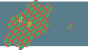

## Initial Inspiration

I've done some stuff involving hexagon grids before and I've always been unsatisfied with the way they require a large resolution to look nice. A regular hexagon has angles which do not go neatly into a grid of squares. On top of that there are issues with needing to have dead-space in the least complicated array encoding unless you specifically wanted a parallelogram board, as well as needing to place the hexagons within a rectangular screen's bounds in a pleasing way.

Well, I think I have a solution to the first of those problems:

instead of six interior 60 degree angles we have two 90 degree angles and four 90 + 45 = 135 angles. This looks decent (to me at least) even at a low resolution. The distance between the horizontal and vertical extrema in each hexagon in this picture is 8 pixels. The adjacent hexagons in the grid intrude onto the 8 by 8 square, but the center of the intruding hexagon is exactly on the corner of the square though, so the hexagon grid stays aligned within a 4by 4 square grid. Additionally if you allow a cursor to be placed only on the left or right of each hexagon, then four-way movement becomes unambiguous. (These last two comments are less surprising if you are aware of the double-width method of indexing a hexagon grid.)

So I want to do something with these kind of hexagons. At minimum I should be able to produce a working example of the cursor idea, where you can toggle colours on the grid. I may go further and try to make a game. I don't really have a great idea for that yet though. Worst case I could make a puzzle where you move half-hexagons around. Maybe a match-three like thing? Would it be fun to make one of those video games where there's a whole bunch of modes and just explore everything you can do with hexagon halves?